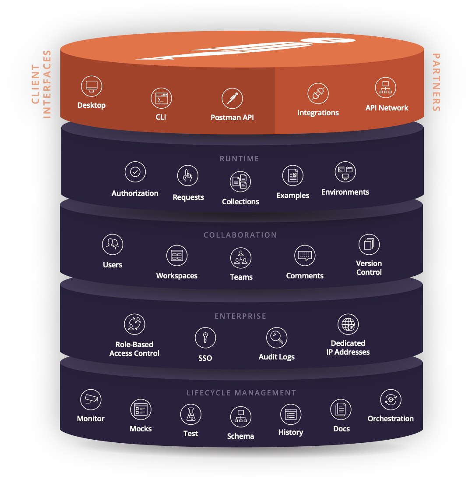

# Activate Thrusters

In the last part of the session, we're going to look at a few areas for further learning, then we can do Q&A, separate into groups, and/or do some self-directed learning with support from helpers. We can dive in more detail into any of the topics we've already covered if that's helpful too.

## 1. Collaboration in Postman

We saw earlier that you can create workspaces in Postman. There are various other features designed to support collaboration.

* You can invite people to workspaces.
* With paid accounts you can specify role based access control.
* You can use version control on APIs and collections.
  * Fork, merge, open pull requests.
* View changelogs for collections, teams, workspaces.

## 2. Monitors

We saw earlier how you can run the requests in a collection using the collection runner. You can schedule these to run and analyze performance using monitors.

* Open a collection and choose the __Monitors__ tab.
* Create a monitor and setup details including run frequency.
* View monitor results in the web dashboard.

## 3. Mock data

You can use Postman to mock data during API design or development. Mocks use examples you specify in Postman to provide test data.

* Open a collection and select the __Mocks__ tab.
* Create a new mock, giving it a name.
* Add examples.
* Use the mock server URL in your requests to return example data instead of hitting the actual API.

## 4. API schema

You can define and model your API using a specification inside Postman. Postman API Builder can act as the single source of truth through multiple phases of your development and testing process.

* In Postman, open __APIs__ on the left.
* You can import or write a spec, for example OpenAPI (formerly Swagger).
* You can generate collections from a schema.
* You can validate against a schema.
* You can connect various other elements to your scheme, e.g. mocks, monitors, tests.

](https://apod.nasa.gov/apod/image/1712/WinterSolsticeMW_Seip.jpg)

## Additional resources

* [Get support on the Postman community forum](https://community.getpostman.com/)
* [Check out the docs](https://learning.postman.com/docs/)
* [Explore the API Network](https://explore.postman.com/)

## Next steps

Follow-up topics for further learning:

* You can write GraphQL queries and specs in Postman. Import the template `Working with GraphQL` and check it out.
* Postman Interceptor allows you to sync cookie data for specified domains. Check out [the docs](https://learning.postman.com/docs/postman/sending-api-requests/interceptor/).
* If you use code generation in Postman, you can customize how your code is generated using the __Settings__ &gt; __New Code Generation Mode__ option then clicking __Code__ in a request and opening the settings to configure the detail for specific languages.
* The Postman Console provides debugging info you can use when troubleshooting your requests—and has recently had an upgrade. Import the template `How to use the Postman console`, open the console from the bottom left, and run the request `message types`, observing the info you can access in the console display.